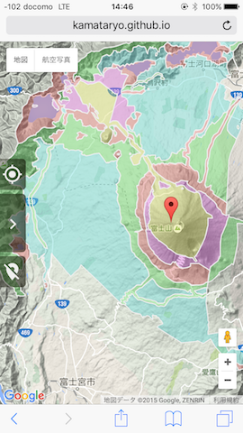

# nationalpark map-国立公園区域

## Abstract-概要
National park map in Japan (restriction area)

日本の国立公園（規制区域）の区域図です。

## How does it work?-どんなものか？

It works like this.

The developmental restricted areas are overlaid on Google Maps.

こんな感じです。

開発規制区域がGoogle Maps上に表示されます。

## License-ライセンス
MIT. see [LICENSE.md](LICENSE.md)

## Attention-注意事項
TopoJSONs are under another License.

TopoJSONファイルは他のライセンス下にあると考えています。

See [topojson/LICENSE.md](topojson/LICENSE.md).
